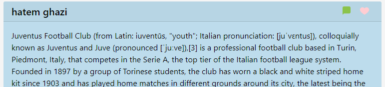
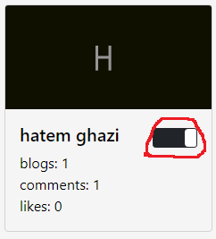
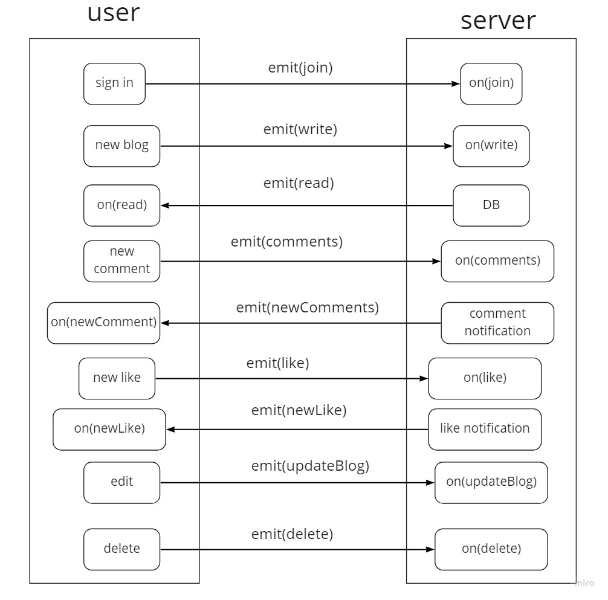

# Blog APP v.1.0 

### Author : Hatem Husnieh & Saeed Awwad  

## The Application  
This application allows users to share their thoughts and knowledge with bothers in real time, and express their thought on other blogs in the form of comments and likes.

## Technologies  
* Node.js
* Socket io
* express
* react.
* heroku (back-end deployment)
* netlify (front-end deployment)
* mongo atlas (mongoDB server)  

## install  
1. copy the link of backend/front end repos.
1. clone both repos on your local machine by `git clone repos-url`
1. download independencies by `npm i`
1. create a `.env`, then cope the content of `.env.sample` file inside the `.env` file.
1. fill the variables of `.env`
1. run the app

## Try it
- [deployed Front-End link](https://60f38c398cfedbcd1d652377--wonderful-northcutt-a044f7.netlify.app/)
- [deployed Back-End link](https://hatem-saeed-blog-backend.herokuapp.com/)
- [front-end-repo](https://github.com/awwadsaeed/blog-front-end.git)
- [back-end-repo](https://github.com/Hatemhusnieh/blog-backend.git)

### Setup  
#### `.env` requirement for Back-End
  - `PORT` - port number  
  - `MONGODB_URL` - port number
#### `.env` requirement for Front-End
  - `REACT_APP_SERVER_URL` - port number   

#### Running the app on local devices  
- Back-End side:  
  - Connect to mongo-DB : `sudo service mongodb start`.
  - Start the server : `npm start` or `nodemon`.
- Front-End side:  
  - start the app: `npm start`.

### Using the APP  
-  Enter your user name and password through the prompt command:  
    
    

    - Output: The opening page of the app where all the blogs by other users are posted:  
  

- To create a blog, start typing in the blog box what is on your mind and hit the `Post` button to post it and share it with other users.  
    
  
  - Output: You blog wll posted as the newest blog at the billboard.  
      

- If any user either commented on your blog or like it, a notification will appear on the right of screen telling what change has happened.
  
    

- After a user has commented on you blog, a new button will appear on the right upper corner of your blog that allows you to see the comments on your blog or hides then.  
    
    

- To like other users blogs scroll to their blog and hit the like button:  
  
    

- To edit your blog choose the edit button, after that a box will appear allowing you to edit your blog:  
  

- You can change the theme of the application by hitting the `theme button` at `user card`  
    
    

### UML:  

